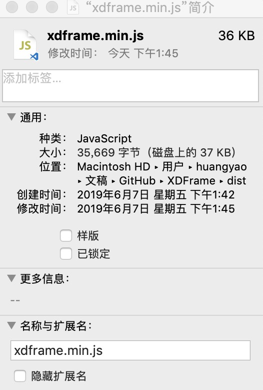

# XDframe Q & A

## 既然已经有了 Vue (React、Angular) ，为什么还要再造一个轮子？

* 作者想让前端回归到像 jQuery 那个时代一样，直接引用就能使用；并且在纯浏览器的环境下，也能有序的开发超大型项目；
* 不爽webpack，现在的前端技术栈都必须webpack；作者是亲原生派，不喜欢在浏览器基础上还有个runtime；每一层技术嵌套都会增加调试成本；（个人观点）
* 三大栈得懂得 nodejs npm （其中还会扩展到系统文件权限命令行等等知识） webpack webpack插件（当然，官方的cli工具已经让这个门槛降低很多了）；
* 三大栈并没有把数据和视图完全结为一体，而是采用订阅机制的做法同步数据；
* XDFrame尝试把视图和数据完全融合；
* 作者认识一个写css很厉害的设计师，他在学习 `nodejs` `npm` `webpack` 过程中被门槛劝退，作者甚是可惜，明明还是懂封装jQuery插件的；
* 提供一种可能性，只需要浏览器环境，就能完成全流程的前端开发，没有预编译，让纯web的系统成为可能；

## 连 nodejs 和 webpack 都学不会，还配做什么前端开发

下面为个人观点；

前端开发（纯界面开发）里css反而更重要；组件状态应该让元素属性来控制；组件封装只要提供状态时修正就够了；

前端开发不应该被nodejs和webpack限制；

## 你是不是对”超大型项目“有什么误解？

[PageCreator](https://kirakiray.com/pageCreator/) 就是基于XDFrame开发的项目；

## XDFrame是用什么库构成的？

具体可查看 `src/` 目录下的文件；

主要由 `Xhear` 和 `drill.js` 两个文件组成；

`drill.js` 的插件 `drill-domcode`，负责静态模板的加载；

`lib.js` 定义 XDFrame 官方库地址和基础信息；

## XDFrame为什么不用 ESM 而用 drill.js？

ESM只能进行模块管理，不能从底层管理资源；用 `drill.js` 可以扩展各种各样类型的文件，还能定制官方的仓库地址，备选仓库方案等等；

XDFrame 内的 `drill.js` 并不只是做模块化管理，它的定位是做 **纯web的npm**；

## XDFrame是 mvc 还是 mvvm 框架？

`Xhear` 是 `mv模型`，既可以做成 mvc 也能做成 mvvm；可以查看文档理解这两种模式；

## XDFrame 会不会不更新没人维护？会不会特别复杂？

作者会一直维护；现在 `stanz`准备升级6 `Xhear`升级5；

XDFrame 很精简，代码量不到jQuery的一半，高级工程师花点时间能看完所有代码；

## 目前作者遇到的困难

得不到支持，欢迎 star；

没钱，欢迎金主爸爸投喂；

