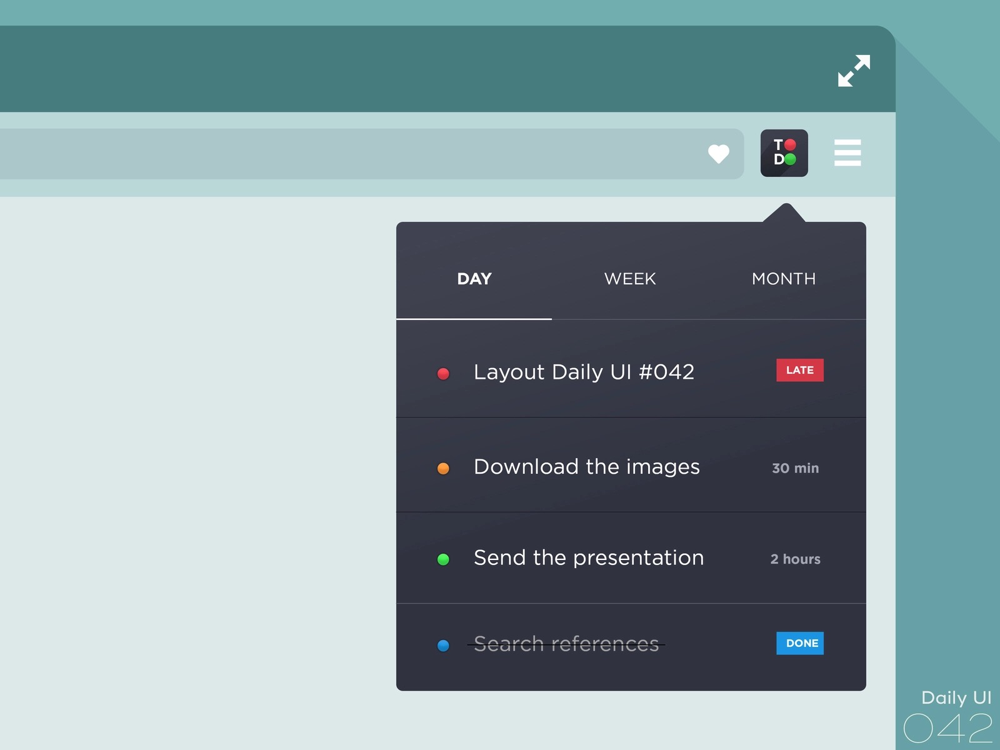

# 使用 XDFrame 制作 todolist 案例；

## 1.首先找个好看的ToDoList设计图

从 dribbble 找的设计图；



[原图片地址在这里](https://dribbble.com/shots/5441213-Daily-UI-042)；本案例仅供学习，不可商用；

## 2.添加需求和确认思路

如果只按照图中的需求来做，无法即时改变 item的状态，所以在图的基础上添加3个需求；

* 添加一个 ALL tab；
* 添加todoitem的输入框；
* 每个item都可以修改状态；

确认制作思路，所有item 都在一个列表上；当切换 DAY WEEK MONTH 的 TAB 时，将不符合要求的隐藏；

## 3.制作静态模板

静态模板在这里 [ToDoList静态模板](https://kirakiray.github.io/XDFrame/demo/todilist_test/js/components/todolist/temp.html)

对伪类不熟悉的同学，也可以把 `:hover` 放到组件逻辑里做；动画采用 css3 的 `transition`；

需要提的css细节是，通过element的属性来控制element的样式；

有机会作者会录个css教程视频；

```less
[tdtype="3"] {
    ...
    .tdi_point {
        background-color: #f94f5a;
    }
    ...
}
[tdtype="4"] {
    ...
    .tdi_point {
        background-color: #1596e9;
    }
    ...
}
```

更具体css细节怎么写，这里不多说；

## 4.封装组件包

在 XDFrame里，包就是一个文件夹；在 `drill.js` 模块管理体系里，同目录下的模块可以使用 `./` 开头引用；而采用 `-pack` 参数，可以载入同目录名的 `js` 文件；

将组件的所有逻辑写在一个目录下，在通过目录同名的 `js` 文件作为目录的入口，进行组建封装，就是 `XD组件包`；

参看 `demo/todilist/js/components/todolist`目录，就是 todolist 的组件包；

[todolist组件封装](https://github.com/kirakiray/XDFrame/blob/master/demo/todilist_test/js/components/todolist/todolist.js)

[todolist item 组件封装](https://github.com/kirakiray/XDFrame/blob/master/demo/todilist_test/js/components/todolist/todoitem.js)

[todolist组件样式(less)](https://github.com/kirakiray/XDFrame/blob/master/demo/todilist_test/js/components/todolist/todilist.less)

关于 `drill.js` 模块和包管理，[请查看文档](https://github.com/kirakiray/drill.js)；

关于 `Xhear` 组件注册细节，[点击查看文档](https://github.com/kirakiray/Xhear)；

封装完 XD组件包后，组件包内在建一个 `test.html` 测试包的使用情况；[点击查看包测试案例](https://kirakiray.github.io/XDFrame/demo/todilist_test/js/components/todolist/test.html)；

## 5.封装主体逻辑

[todolist 入口html](https://github.com/kirakiray/XDFrame/blob/master/demo/todilist_test/main.html)

[todolist 主体 main.js](https://github.com/kirakiray/XDFrame/blob/master/demo/todilist_test/js/main.js)

主体 `main.js` 的逻辑：

* 将旧数据填充到 todolist
* 记录数据到 localStorage
* 衔接 输入框 到 todolist

[点击查看完整版的 todoList](https://kirakiray.github.io/XDFrame/demo/todilist_test/main.html)；

